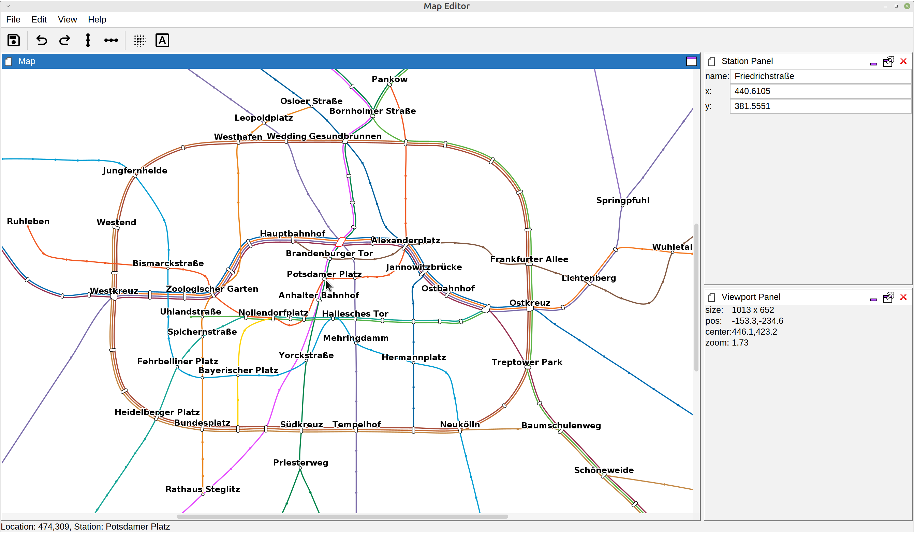
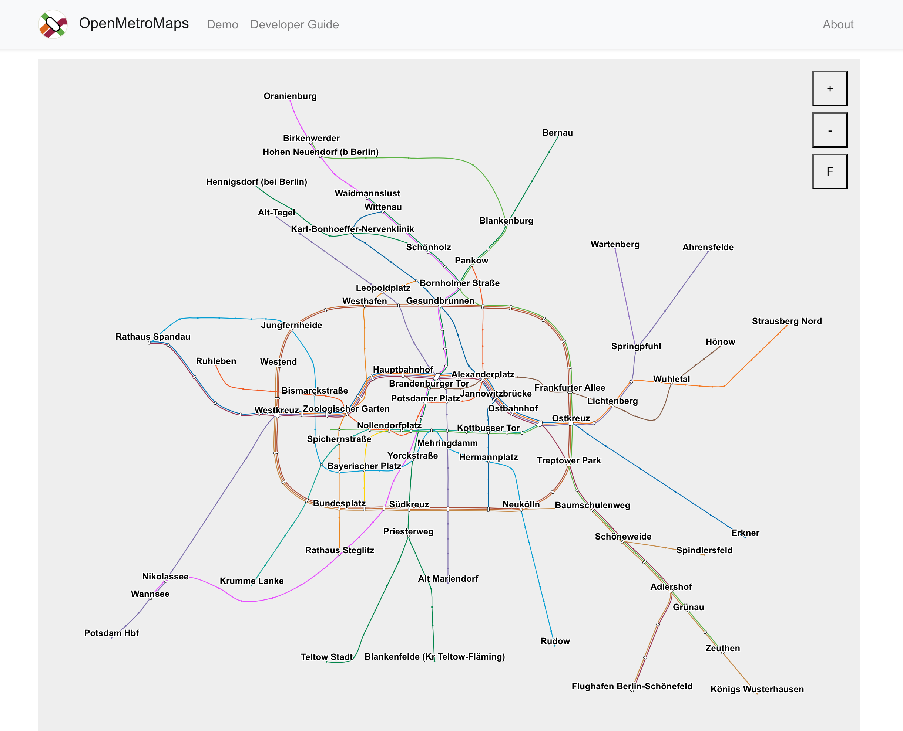

# OpenMetroMaps

This is the main repository of the
[OpenMetroMaps](https://www.openmetromaps.org) project.
Data projects for cities/regions are stored within the
[OpenMetroMapsData](https://github.com/OpenMetroMapsData) organization to keep
the namespaces for data and code projects separated. Also see the
[list of data projects](data-projects.md).

**Table of Contents**
* [File Format](#file-format)
* [Desktop Tools](#desktop-tools)
* [Web Viewer](#web-viewer)
* [Data Sources](#data-sources)
    * [OpenStreetMap](#openstreetmap)
    * [GTFS](#gtfs)
    * [Other Sources](#other-sources)
* [Station Data](#station-data)
* [Research](#research)
* [Other Ideas](#other-ideas)
    * [Nick-name map for Berlin](#nick-name-map-for-berlin)

## File Format

A major goal of this project is to develop a file format for storing schematic
maps for public transport networks.
There's no complete formal specification of the file format yet and features of the
format are still under construction.
To get an overview take a look at a small [example file](example-data/example.xml)
that illustrates the basic concepts:

```xml
<?xml version="1.0" encoding="UTF-8" standalone="no"?>
<omm-file version="1.0.0">
  <stations>
    <station lat="52.521515" lon="13.412305" name="Alexanderplatz"/>
    <station lat="52.520387" lon="13.386885" name="Friedrichstraße"/>
    <station lat="52.522648" lon="13.402209" name="Hackescher Markt"/>
  </stations>
  <lines>
    <line circular="false" color="#006CB3" name="S3">
      <stop station="Alexanderplatz"/>
      <stop station="Hackescher Markt"/>
      <stop station="Friedrichstraße"/>
    </line>
  </lines>
  <view name="Berlin" scene-height="904.137943" scene-width="1000.000000" start-x="386.178629" start-y="478.710910">
    <edges line="S3"/>
    <edges line="S45">
      <interval from="Adlershof" to="Flughafen Berlin-Schönefeld"/>
    </edges>
    <station name="Alexanderplatz" x="424.775181" y="461.793637"/>
    <station name="Friedrichstraße" x="392.200080" y="459.965281"/>
    <station name="Hackescher Markt" x="408.133553" y="459.451927"/>
  </view>
</omm-file>
```

To see a full file, have a look at the [Berlin testing file](java/test-data/src/main/resources/berlin.omm).
You can also check out the [specification draft](spec-map-format.md).

## Desktop Tools

We're developing a set of desktop tools for working with the map files.
Those tools are written in Java and user interfaces are based on Swing with
DockingFrames for dockable dialogs.

One core component is the Map Editor that allows you to create new maps based on
OpenStreetMap data or from scratch and lets you manipulate existing maps.



If you want to run the editor or start hacking on the desktop tools, please have
a look at the relevant
[README file](java/README.md).

## Web Viewer

We're also building a Javascript-based Web Viewer for the file format to
allow for easy presentation of results in a browser without the need to install
any desktop software. Although it would also be nice to have a native Javascript
implementation of a web viewer, we're eager to maximize code reuse and try to
use the main Java source via transpilation to Javascript. In order to do that
we use [GWT](gwt).
Have a look at <https://openmetromaps.org/demo> to see it in action.



## Data Sources

We currently support data imports from the following sources:
* [OpenStreetMap](https://www.openstreetmap.org/about) (OSM)
* [General Transit Feed Specification](http://gtfs.org) (GTFS)

Both types of import can be done using the [Command Line
Interface](java/README.md#command-line-interface-cli).
See the commands `osm-import` for importing OSM data and `gtfs-import` for
importing GTFS data.

### OpenStreetMap

* If you're not familiar with the OpenStreetMap project, start by browsing
  through the pages listed on the [Use
  OpenStreetMap](https://wiki.openstreetmap.org/wiki/Use_OpenStreetMap)
  page on the OSM Wiki.
* See the [Downloading
  data](https://wiki.openstreetmap.org/wiki/Downloading_data) page
  on the OSM Wiki on how to obtain suitable OSM data.
* Probably you want to use smaller extracts such as those available from
  [Geofabrik downloads](http://download.geofabrik.de) instead of downloading
  the whole planet as a file. Using the [Overpass
  API](https://wiki.openstreetmap.org/wiki/Overpass_API) is also a good
  way for obtaining relevant data sets.

### GTFS

* [TransitFeeds](https://transitfeeds.com) collects links to
  official GTFS data worldwide ([GitHub page](https://github.com/TransitFeeds))

### Other Sources

The file format is text-based and pretty simple, so you can create a data
file with a normal text editor.
When you want to use existing data, you can write an import algorithm of
your own.

[Wikidata](https://www.wikidata.org) also stores information about
stations, lines and the like.

## Station Data

In addition to the main map file format, we're also working on an additional
file format and corresponding tools to collect data about stations and their
tracks. In particular, files in this format store locations of things on a station's
track as a relative position on the train (front to back / tail).
This information can be used to compute efficient micro-routing within line
networks, i.e. optimize on which car to board a train to reach something most
quickly on the destination station such as a specific exit or a stairway to your
connecting train.
See an [example file](example-data/example-stations.xml)
or the [Berlin testing file](java/test-data/src/main/resources/berlin-stations.xml)
to get an idea of how this file works.
Also see the [specification draft](spec-station-format.md) and a longer
discussion on the [requirements of that format](station-data.md).

## Research

We're also gathering material about transit maps in general on the
[Research](research/research.md)
page.

## Other Ideas

* It would be nice to be able to create morphing animations from two views
  of the same network. Inspired by
  [this article](http://mymodernmet.com/animated-subway-maps) about
  a number of posts on reddit
  ([Berlin](https://www.reddit.com/r/dataisbeautiful/comments/6baefh/berlin_subway_map_compared_to_its_real_geography/)).
  **Done** via the `maps-morpher` module and the CLI's `map-morpher` task.
* Build something like [this interactive route planner](http://jannisr.de/vbb-map-routing) using
  the Javascript viewer component.
* Integrate the Android component into
  [Transportr](https://github.com/grote/Transportr).
* Implement different optimization algorithms to transform geographic
  maps into schematic maps automatically. Some hints on how to get started
  with that are [already available](java#writing-an-optimization-algorithm).
  Also, there is an
  [implementation](https://github.com/dirkschumacher/TransitmapSolver.jl)
  available which could possibly be built upon (although the license changed
  from MIT to GPL, which makes it impossible to integrate easily).
  We collect a [list of papers](research/optimization-algorithms.md)
  about possible algorithms.

### Nick-name map for Berlin

Possible resources:
* <https://de.wikipedia.org/wiki/Berolinismus>
* <https://github.com/derhuerst/vbb-common-places/blob/master/stations.json>
